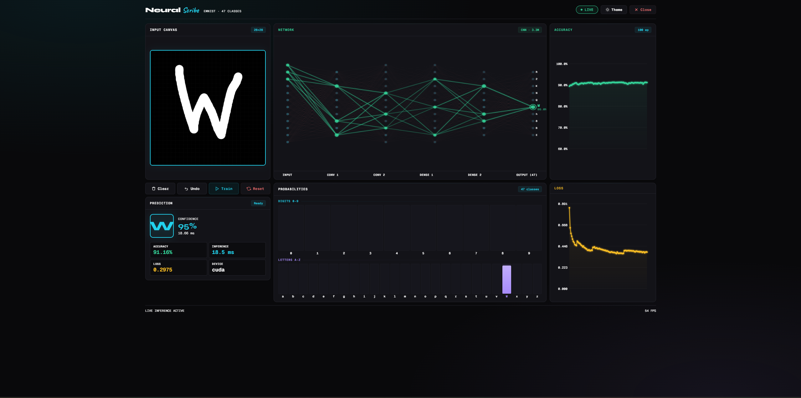
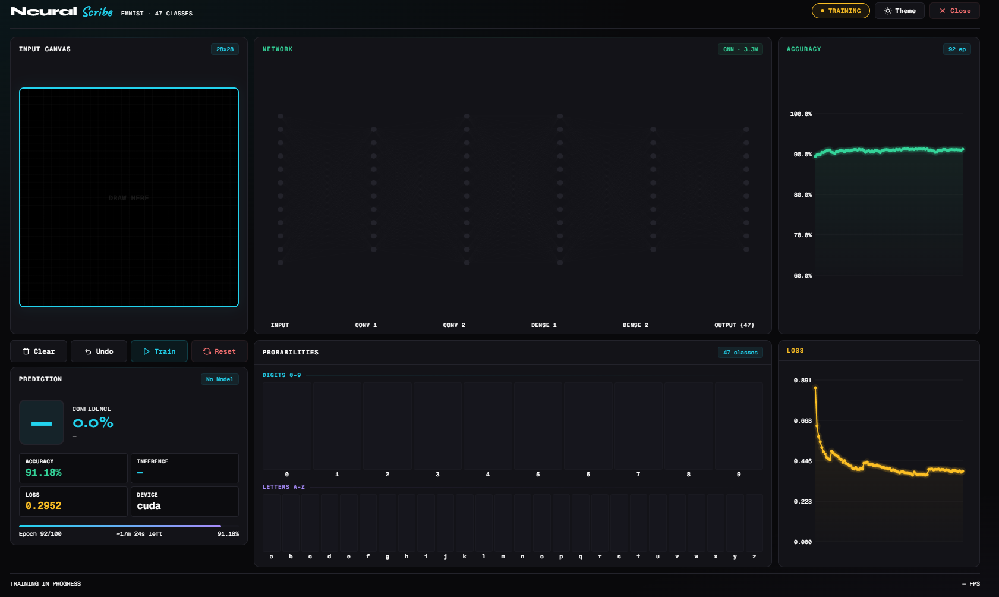
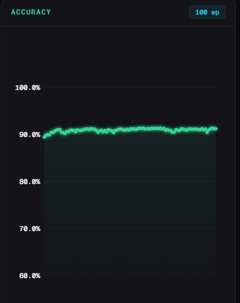
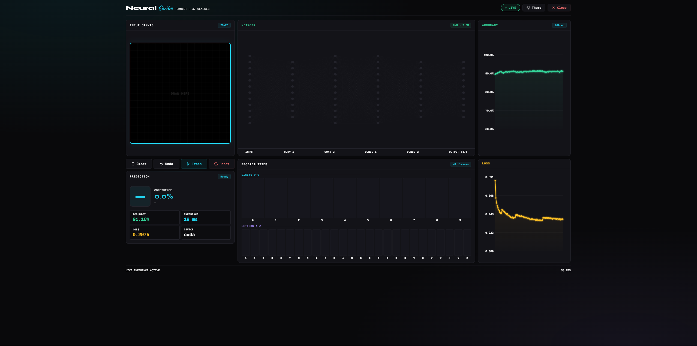
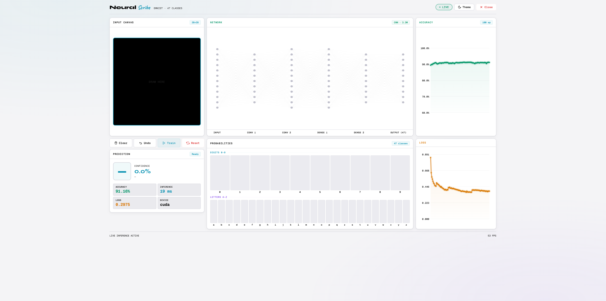

# NeuralScribe

**Real-time handwritten character recognition with live neural network visualization.**

[](https://python.org)
[](https://pytorch.org)
[](https://fastapi.tiangolo.com)
[](LICENSE)

<!-- 
📸 HERO IMAGE — Full dashboard, dark theme, character drawn, prediction active.
   Draw "R" or "7" so network viz + confidence bars light up.
   Save as: assets/hero.png (1920×1080)
-->


---

## What Is This?

NeuralScribe trains a CNN on the **EMNIST ByMerge** dataset — 47 classes covering digits `0–9`, uppercase `A–Z`, and 11 lowercase letters `a b d e f g h n q r t`. You draw a character on a canvas, and the neural network predicts what you wrote in real time, updating mid-stroke with no button clicks. A live visualization shows the 6-layer CNN activating as predictions form.

<!-- 
🎬 DEMO GIF — 8–12 seconds: draw → prediction live → clear → draw another.
   720p, 15fps. Tools: ScreenToGif / Kap / Peek
   Save as: assets/demo.gif
-->


---

## Features

| Feature | Detail |
|---------|--------|
| **Live inference** | Predictions update mid-stroke via WebSocket. A pixel queue ensures continuous predictions — drawing is never blocked by pending responses |
| **6-layer network visualization** | Watch Input → Conv1 → Conv2 → Dense1 → Dense2 → Output(47) activate. Green = predicted path, red = competing activations |
| **Train from the UI** | Click Train, set 5–100 epochs with a slider, watch accuracy and loss charts update each epoch with ETA countdown |
| **Dark & light themes** | Toggle with one click, preference saved to localStorage. Smooth 350ms transitions between themes |
| **47-class confidence bars** | Full probability distribution — digits in cyan, letters in violet. Winning class highlighted with glow effect |
| **Stroke undo** | Undo button pops the last stroke. Full stroke history preserved |
| **Test-time augmentation** | 5 inference variants (original + ±4° rotation + 1px shifts) averaged for more robust predictions |
| **GPU acceleration** | Auto-detects CUDA. Mixed precision training (fp16) for ~1.5–2x speedup on RTX GPUs |

---

## Quick Start

```bash
# Clone
git clone https://github.com/yourusername/neuralscribe.git
cd neuralscribe

# Environment
python -m venv .venv
.venv\Scripts\activate
python.exe -m pip install --upgrade pip

# Dependencies
pip install -r requirements.txt

# GPU support (CUDA 12.8)
pip install torch torchvision --index-url https://download.pytorch.org/whl/cu128

# Launch
python run_backend.py
```

Open **http://localhost:8000** → Click **Train** → Set 35 epochs → Start → Draw.

> First run downloads EMNIST (~500 MB). Training takes ~10–20 min on GPU, longer on CPU.

<!-- 
📸 TRAINING — Capture mid-training: progress bar with ETA, accuracy chart building,
   loss declining, "TRAINING" status pill in amber.
   Save as: assets/training.png
-->


---

## Project Structure

```
neuralscribe/
├── frontend/
│   ├── index.html              # Dashboard page
│   ├── style.css               # Design system (dark + light themes)
│   ├── main.js                 # Entry point — WebSocket, DOM bindings
│   ├── state/
│   │   └── appState.js         # Reactive state store (pub/sub)
│   └── ui/
│       ├── theme.js            # Dark/light toggle + localStorage
│       ├── canvas.js           # Drawing, undo stack, pixel extraction
│       ├── networkViz.js       # 6-layer CNN visualization (cached wireframe)
│       └── charts.js           # Accuracy + Loss chart rendering
├── backend/
│   ├── api/
│   │   └── app.py              # FastAPI server + WebSocket
│   ├── interface/
│   │   ├── preprocess.py       # Canvas → EMNIST tensor pipeline
│   │   └── predictor.py        # Inference engine with TTA
│   ├── train/
│   │   ├── model.py            # CNN architecture (ResBlocks + SE attention)
│   │   ├── dataset.py          # EMNIST data loader + augmentation
│   │   └── train.py            # Training loop (mixed precision, warm restarts)
│   └── models/
│       └── digit_model.pt      # Trained weights (generated after training)
├── data/raw/emnist/            # EMNIST data (auto-downloaded)
├── run_backend.py              # Server launcher
├── requirements.txt
└── README.md
```

---

## How It Works

### Data Flow

```
Draw on canvas
     │
     ▼
canvas.js extracts 28×28 pixels (bounding box crop + scale + 90° rotation)
     │
     ▼
main.js sends pixels via WebSocket ──────► backend app.py receives
                                                    │
                                                    ▼
                                           preprocess.py:
                                             1. Normalize to [0,1]
                                             2. Gaussian smoothing
                                             3. Center-of-mass alignment
                                             4. EMNIST transpose
                                             5. EMNIST normalization (μ=0.175, σ=0.333)
                                                    │
                                                    ▼
                                           predictor.py:
                                             1. Create 5 TTA variants
                                                (original, ±4° rotation, 1px shifts)
                                             2. Forward pass through CNN
                                             3. Average probabilities
                                             4. Extract activations for viz
                                                    │
                                                    ▼
WebSocket returns prediction ◄─────────── JSON response:
     │                                      label, confidence, probabilities[47],
     ▼                                      activations{conv1,conv2,fc1}, inference_ms
appState.update({ prediction })
     │
     ├──► networkViz.js redraws (from wireframe cache)
     ├──► confidence bars update (47 bars)
     └──► prediction display updates (character, confidence, ms)
```

<!-- 
🎬 NETWORK VIZ GIF — 5 seconds, cropped to just the network panel.
   Draw one character → clear → draw another. Connections shift between predictions.
   Save as: assets/network-viz.gif
-->


### Frontend Architecture

The frontend uses **vanilla ES modules** — zero dependencies, no build step.

All communication between modules goes through a reactive state store:

```
User action → module → appState.update() → subscribers re-render
```

No module touches another module's DOM. This prevents race conditions when training updates and predictions arrive simultaneously.

**appState.js** is a tiny pub/sub system:

```javascript
subscribe('prediction', (pred) => { /* update DOM */ });
update({ prediction: { label: '7', confidence: 94.2 } });
```

**Performance optimizations:**
- **Wireframe caching** — the static network grid is drawn once and stored as `ImageData`. Each frame blits the cache with `putImageData()` then draws only active connections on top.
- **requestAnimationFrame gating** — duplicate draw calls are collapsed into one frame.
- **Pixel queue** — while waiting for a prediction response, new draw events store the latest pixels. When the response arrives, queued pixels fire immediately. Drawing is never blocked by slow inference.

### WebSocket Protocol

The frontend and backend communicate via JSON messages over a single WebSocket:

| Direction | Type | Purpose |
|-----------|------|---------|
| Client → Server | `predict` | Send 784 pixel values for inference |
| Client → Server | `train` | Start training with `{ epochs: N }` |
| Client → Server | `reset_model` | Delete weights and reset predictor |
| Client → Server | `shutdown` | Kill the backend server |
| Client → Server | `ping` | Keepalive (every 15 seconds) |
| Server → Client | `init` | Model status, device, training history on connect |
| Server → Client | `prediction` | Label, confidence, probabilities, activations, inference_ms |
| Server → Client | `training_started` | Training begun, total epochs |
| Server → Client | `training_update` | Per-epoch: accuracy, train/test loss, epoch time, LR |
| Server → Client | `training_complete` | Final accuracy, full history |
| Server → Client | `training_error` | Error message if training fails |
| Server → Client | `model_reset` | Confirms model deleted |
| Server → Client | `shutdown_ack` | Server shutting down |

REST fallback endpoints: `POST /api/predict`, `GET /api/status`, `POST /api/shutdown`.

---

## Model Architecture

```
Input (1×28×28)
     │
     ▼
Stem: Conv2d(1→32, 3×3) → BatchNorm → ReLU
     │
     ▼
ResBlock1: 32→64, stride 2 → 14×14     (SE attention, drop_path=0.05)
     │
     ▼
ResBlock2: 64→160, stride 2 → 7×7      (SE attention, drop_path=0.10)
     │
     ▼
ResBlock3: 160→320, stride 1 → 7×7     (SE attention, drop_path=0.15)
     │
     ▼
ResBlock4: 320→256, stride 1 → 7×7     (SE attention, drop_path=0.20)
     │
     ▼
Global Average Pooling → Dropout(0.4) → Linear(256→47)
```

**3,348,815 parameters** · Mixed precision (fp16 on CUDA)

### Dataset

| | Samples | Batches (batch_size=128) |
|---|---------|---------|
| **Train** | 697,932 | 5,452 |
| **Test** | 116,323 | 455 |

8 DataLoader workers · pin_memory · persistent_workers

Each **ResBlock** contains:
- Conv 3×3 → BatchNorm → ReLU → Conv 3×3 → BatchNorm → SE Block → residual add → ReLU
- **Skip connection**: 1×1 conv when channels or spatial size change
- **Stochastic depth** (DropPath): randomly skips blocks during training, increasing from 5% to 20% deeper in the network

**SE Block** (Squeeze-and-Excitation): Global average pool → FC down → ReLU → FC up → Sigmoid → channel-wise multiply. Learns which feature channels matter most. Helps distinguish confusable pairs like O/0, l/1/I, S/5.

**Why these design choices:**
- **BatchNorm** after every conv stabilizes training and allows a higher learning rate (0.003)
- **Residual connections** prevent vanishing gradients — deeper blocks train as easily as shallow ones
- **Global average pooling** instead of flatten reduces parameters from 12,544 → 256 going into the final FC
- **Stochastic depth** is a regularizer that prevents deeper layers from overfitting
- **4 ResBlocks** with channels 64→160→320→256 gives enough capacity for 47 confusable character classes

---

## Training Pipeline

### Optimizer & Scheduler

- **AdamW** with decoupled weight decay (1e-4) and learning rate 0.003
- **CosineAnnealingWarmRestarts** (T_0=10, T_mult=2): the learning rate follows a cosine curve that resets every 10 epochs, then every 20, then 40. Each restart lets the model escape local minima and explore new solutions. This is why 30–50 epochs works better than 15 — more restart cycles.

### Loss Function

**Focal Loss** with label smoothing:
- **Focal** (γ=2.0): down-weights easy examples, focuses training on hard/confusable characters. A confidently correct prediction gets near-zero loss. A confused O/0 prediction gets amplified loss.
- **Label smoothing** (0.1): target for correct class is 0.9 instead of 1.0, remainder spread across other classes. Prevents overconfident outputs that hurt generalization.

<!-- 
📸 ACCURACY — After training completes, capture the accuracy chart showing the full curve.
   Save as: assets/accuracy.png
-->


### Data Augmentation

Training images pass through this pipeline (test images do not):

| Transform | Parameters | Purpose |
|-----------|------------|---------|
| RandomAffine | ±10° rotation, ±10% translate, 90–110% scale | Simulates natural drawing variation |
| RandomPerspective | 15% distortion, 30% probability | Simulates viewing angle (phone tilt) |
| GaussianBlur | kernel 3, σ 0.1–0.7 | Simulates different stroke widths |
| RandomErasing | 2–25% area, 50% probability | Forces recognition with missing parts |

### Mixup Regularization

During training, random pairs of images are blended: `x = λ·x₁ + (1-λ)·x₂` with labels mixed the same way (α=0.2). This smooths decision boundaries between classes and reduces overfitting.

### Mixed Precision

On CUDA GPUs, forward passes run in fp16 (`torch.amp.autocast`) while gradient accumulation stays in fp32. The `GradScaler` prevents fp16 underflow. This gives ~1.5–2x speedup on RTX GPUs with tensor cores at no accuracy cost. CPU training runs in fp32 only.

### Gradient Clipping

`clip_grad_norm_(max_norm=1.0)` prevents rare large gradients from destabilizing training.

---

## Preprocessing Pipeline

The canvas-to-model pipeline must exactly match how EMNIST training data is formatted. Any mismatch is a systematic error that no model improvement can fix.

| Step | What | Why |
|------|------|-----|
| 1. Bounding box crop | Crop to drawn content + padding | Remove empty space |
| 2. Scale to 28×28 | Fit into model input size, maintain aspect ratio | Match EMNIST dimensions |
| 3. 90° CCW rotation + vertical flip | Correct canvas orientation | Canvas captures in screen orientation; EMNIST has its own |
| 4. Normalize to [0,1] | Divide by 255 | Standard pixel normalization |
| 5. Gaussian smoothing | 3×3 kernel, 70/30 blend with original | Canvas strokes are sharper than EMNIST — softening matches the training distribution |
| 6. Center-of-mass alignment | Shift so brightness centroid is at (13.5, 13.5) | EMNIST uses center-of-mass positioning, not bounding-box centering |
| 7. EMNIST transpose | `.T` on the 2D array | Matches `TransposeImage()` applied during training |
| 8. EMNIST normalization | `(pixels - 0.1751) / 0.3332` | Mean/std computed from the EMNIST training set |

### Test-Time Augmentation (TTA)

At inference, 5 variants of the input are created and predictions averaged:

| Variant | Transform |
|---------|-----------|
| 1 | Original (unchanged) |
| 2 | Rotated +4° clockwise |
| 3 | Rotated -4° counter-clockwise |
| 4 | Shifted 1 pixel right |
| 5 | Shifted 1 pixel down |

These correct for natural drawing variation — slightly tilted characters, off-center strokes. Averaging 5 predictions is more robust than a single prediction. Cost is ~5x inference time, but single inference is 1–3ms on GPU so TTA still runs in ~5–15ms.

TTA can be disabled in `predictor.py` with `use_tta=False` for faster inference.

---

## Design System

<!-- 
📸 DARK + LIGHT SIDE BY SIDE — Same character drawn in both themes. Crop identically.
   Save as: assets/dark-theme.png and assets/light-theme.png
-->
| Dark Theme | Light Theme |
|:---:|:---:|
|  |  |

### Typography

| Font | Weight | Used For |
|------|--------|----------|
| **Syne** | 800 | Brand name "Neural" — geometric, technical |
| **Caveat** | 700 | Brand name "Scribe" — handwriting accent (the theme) |
| **Outfit** | 300–700 | Body text, modal content |
| **Geist Mono** | 400–800 | Stats, labels, confidence values, code |

### Color Palette

| Token | Dark Theme | Light Theme | Used For |
|-------|-----------|-------------|----------|
| `--accent` | `#22d3ee` cyan | `#0891b2` teal | Canvas border, predictions, primary actions |
| `--green` | `#34d399` emerald | `#059669` green | Network viz, accuracy chart, success |
| `--violet` | `#a78bfa` purple | `#7c3aed` violet | Letter confidence bars, progress gradient |
| `--amber` | `#fbbf24` gold | `#d97706` amber | Loss chart, training status, warnings |
| `--red` | `#f87171` red | `#dc2626` red | Reset/close actions, competing network paths |

### Layout

3-column grid (400px | flexible | 340px) × 2 rows:

| | Column 1 | Column 2 | Column 3 |
|---|----------|----------|----------|
| **Row 1** | Drawing canvas | Neural network viz | Accuracy chart |
| **Row 2** | Controls + prediction | Confidence bars (47) | Loss chart |

Collapses to single column below 1400px.

---

## Dependencies

```
torch>=2.0.0
torchvision>=0.15.0
fastapi>=0.104.0
uvicorn[standard]>=0.24.0
websockets>=12.0
numpy>=1.24.0
pydantic>=2.0.0
```

Frontend has **zero dependencies** — vanilla HTML/CSS/JS with ES modules.

<!-- 
📸 CONFIDENCE BARS — Crop to just the confidence bars panel showing a letter prediction.
   Digits in cyan, letters in violet, winning class glowing.
   Save as: assets/confidence-bars.png
-->


---

## Troubleshooting

| Problem | Fix |
|---------|-----|
| "No Model" after launch | Click Train → set epochs → Start. Model saves to `backend/models/digit_model.pt` |
| Wrong predictions | Delete `backend/models/digit_model.pt` and retrain with 35+ epochs |
| CUDA out of memory | Reduce `batch_size` in `train.py` (try 64) |
| Slow inference (>100ms) | Set `use_tta=False` in `predictor.py` for ~5x speedup |
| 3 FPS on GPU | TTA makes each prediction 5 forward passes. Disable for raw speed |
| WebSocket keeps disconnecting | Check firewall/proxy on port 8000. The client auto-reconnects every 2 seconds |
| EMNIST download fails | Manually download from [EMNIST site](https://www.nist.gov/itl/products-and-services/emnist-dataset) into `data/raw/emnist/` |
| Training stalls on Windows | `dataset.py` uses `persistent_workers=True` — if it hangs, reduce `num_workers` to 0 |

---

## License

MIT

---

<p align="center">
  <b>Neural</b><i>Scribe</i> — watch a neural network learn to read your handwriting.
</p>